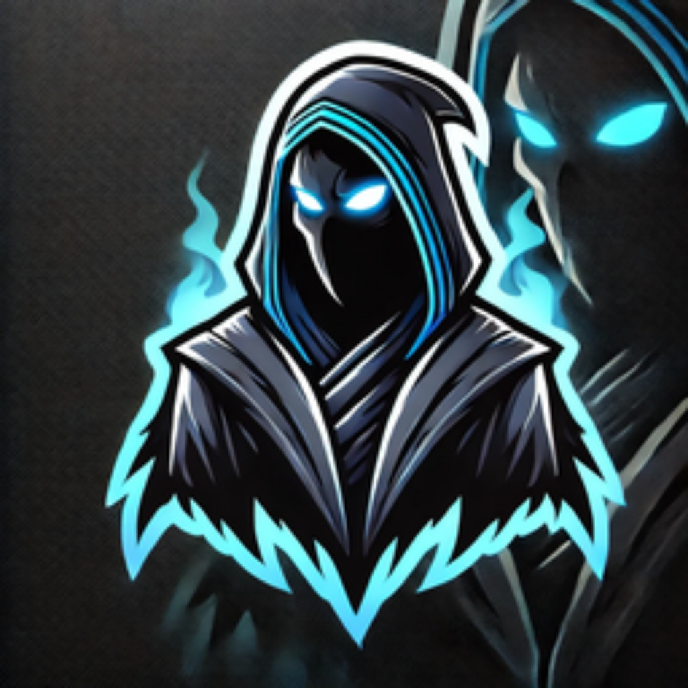

# ✨ Wardizitto - Seu Bot Discord Multifuncional ✨

<div align="center">
  

  <p>
   <a href="LICENSE"></a>
    
    
    
    
  </p>

  <p><strong>Um bot Discord versátil e robusto, desenvolvido para enriquecer a experiência da sua comunidade com funcionalidades de moderação, economia, social e utilidades.</strong></p>

  <a href="#-descrição">Descrição</a> •
  <a href="#-funcionalidades-principais">Funcionalidades</a> •
  <a href="#-tecnologias-utilizadas">Tecnologias</a> •
  <a href="#-instalação-e-configuração">Instalação</a> •
  <a href="#-estrutura-do-projeto">Estrutura</a> •
  <a href="#-contribuição">Contribuição</a> •
  <a href="#-licença">Licença</a>
</div>

---

## 🚀 Descrição

**Wardizitto** é um bot Discord robusto e versátil, projetado para elevar a experiência da sua comunidade! 🤖 Desenvolvido em **Node.js** com a poderosa biblioteca `discord.js`, ele oferece uma vasta gama de comandos e funcionalidades que abrangem desde a moderação essencial até sistemas de economia complexos e interações sociais divertidas. Tudo isso é impulsionado por um eficiente banco de dados **MySQL** para garantir a persistência e segurança dos seus dados.

## 🌟 Funcionalidades Principais

O Wardizitto está repleto de recursos, organizados em categorias intuitivas para facilitar a gestão e a diversão no seu servidor:

### 🛡️ 1. Administração
Comandos essenciais para a gestão do servidor, incluindo a criação de sistemas de tickets 🎫, sorteios 🎉 e painéis de controle administrativos.

### 🎮 2. Diversão
Traga mais entretenimento para seus membros com jogos como Jogo da Velha ❌⭕, adivinhação 🧠, dados 🎲, memes engraçados 😂 e contagens regressivas ⏳.

### 💰 3. Economia
Um sistema de economia completo! Os usuários podem ter perfis 📊, realizar transferências 💸, depósitos 🏦, saques e até escolher profissões 👷 para ganhar dinheiro no servidor.

### 🔨 4. Moderação
Ferramentas poderosas para manter seu servidor seguro e organizado. Inclui adição de emojis personalizados ✨, limpeza de mensagens 🧹, gerenciamento de usuários (ban 🚫, unban ✅, lock/unlock canais 🔒🔓), avisos ⚠️ e comunicados importantes 📢.

### ❤️ 5. Social
Incentive a interação entre os membros com comandos sociais como abraços 🤗, beijos 😘, casamentos 💍, shippar casais 💖 e compartilhamento de fanarts 🎨.

### 🛠️ 6. Utilidades
Um conjunto de ferramentas úteis para o dia a dia, como informações detalhadas do bot ℹ️, dados de usuário 👤 e servidor 🖥️, calculadora ➕➖, verificação de ping 📡, status AFK 🌙, e integrações com APIs como VirusTotal 🦠 e GitHub 🐙.

## 💻 Tecnologias Utilizadas

O projeto Wardizitto é construído sobre uma base tecnológica sólida:

*   **Node.js**: O ambiente de execução JavaScript que alimenta o bot.
*   **discord.js**: A biblioteca oficial e mais popular para interagir com a API do Discord.
*   **MySQL**: Um sistema de gerenciamento de banco de dados relacional de alta performance para todas as informações do bot.
*   **Groq SDK**: Utilizado para funcionalidades avançadas de IA e processamento de linguagem natural 🧠.
*   **VirusTotal API**: Para garantir a segurança, verificando arquivos e links suspeitos 🛡️.
*   **Outras bibliotecas**: `@discordjs/builders`, `@discordjs/rest`, `@discordjs/voice`, `axios`, `canvas`, `jimp`, `moment`, `ms`, `mysql2`, `qrcode`, `uuid`, `ytdl-core`, entre outras, para funcionalidades específicas e otimização.

## ⚙️ Instalação e Configuração

Para colocar o Wardizitto em funcionamento no seu servidor, siga estes passos:

1.  **Clone o repositório:**
    ```bash
    git clone https://github.com/THZIMX/Wardizitto.git
    cd Wardizitto
    ```

2.  **Instale as dependências:**
    ```bash
    npm install
    ```

3.  **Configure o `config.json`:**
    Crie um arquivo `config.json` na raiz do projeto com as seguintes informações. **Lembre-se de manter suas chaves e tokens seguros!**
    ```json
    {
      "token": "SEU_TOKEN_DO_BOT",
      "clientId": "SEU_CLIENT_ID_DO_BOT",
      "canal_bugs": "ID_DO_CANAL_DE_BUGS",
      "canal_fanarts_revisao": "ID_DO_CANAL_DE_FANARTS_EM_REVISAO",
      "mariaDB": {
        "host": "SEU_HOST_MYSQL",
        "user": "SEU_USUARIO_MYSQL",
        "password": "SUA_SENHA_MYSQL",
        "database": "SEU_BANCO_DE_DADOS_MYSQL"
      },
      "quickDB": {
        "storage": "./databases/databases.json"
      },
      "webhookLogs": {
        "url": "URL_DO_WEBHOOK_DE_LOGS"
      },
      "groqApiKey": "SUA_API_KEY_GROQ",
      "virustotal_api_key": "SUA_API_KEY_VIRUSTOTAL"
    }
    ```
    *   Substitua `SEU_TOKEN_DO_BOT` e `SEU_CLIENT_ID_DO_BOT` pelas credenciais obtidas no [Portal do Desenvolvedor Discord](https://discord.com/developers/applications).
    *   Preencha as informações do `mariaDB` com os detalhes do seu servidor de banco de dados **MySQL**.
    *   Configure `canal_bugs`, `canal_fanarts_revisao` e `webhookLogs.url` com os IDs de canais e URL de webhook do seu servidor para logs e funcionalidades específicas.
    *   Obtenha as chaves de API para `groqApiKey` (Groq) e `virustotal_api_key` (VirusTotal) se for utilizar essas funcionalidades avançadas.

4.  **Execute o bot:**
    ```bash
    node index.js
    ```

## 📂 Estrutura do Projeto

Uma visão geral da organização do projeto Wardizitto:

```
Wardizitto/
├── commands/                 # 🚀 Todos os comandos do bot, organizados por categoria
│   ├── ADMINISTRAÇÃO/        # 🛡️ Comandos de administração do servidor
│   ├── DIVERSÃO/             # 🎮 Comandos de entretenimento e jogos
│   ├── DONO-BOT/             # 👑 Comandos exclusivos para o dono do bot
│   ├── ECONOMIA/             # 💰 Comandos relacionados ao sistema de economia
│   ├── MODERAÇÃO/            # 🔨 Comandos de moderação do servidor
│   ├── SOCIAL/               # ❤️ Comandos de interação social
│   └── UTILIDADES/           # 🛠️ Comandos de utilidade geral
├── databases/                # 🗄️ Arquivos de banco de dados (JSON) para dados leves
│   ├── database.json
│   ├── doacoes.json
│   ├── emojis.json
│   ├── myJsonDatabase.json
│   └── warnings.json
├── events/                   # 🔔 Manipuladores de eventos do Discord
│   ├── ECONOMIA/
│   ├── Art-fã.js
│   ├── Report-bug.js
│   ├── Verificacao.js
│   ├── canal-env.js
│   ├── comunicado.js
│   ├── gerenciarUsuario.js
│   ├── githubSelect.js
│   ├── guildCraete.js
│   ├── guildMemberUpdate.js
│   ├── guildUpdate.js
│   ├── interactionCreate.js
│   ├── logs.js
│   ├── mentionResponse.js
│   ├── messageCreate.js
│   ├── ready.js
│   ├── sair.js
│   ├── ticket.js
│   └── top-casal.js
├── handlers/                 # 🔗 Funções para carregar comandos e eventos
│   ├── commandHandler.js
│   ├── db.js
│   └── eventHandler.js
├── models/                   # 💾 Modelos de banco de dados (ex: MySQL)
│   └── mariadb.js            # Nota: O arquivo mariadb.js pode precisar ser renomeado ou adaptado para MySQL puro.
├── utils/                    # 🔧 Funções utilitárias e helpers
│   └── virusTotal.js
├── config.json               # ⚙️ Arquivo de configuração principal do bot
├── index.js                  # 🚀 Ponto de entrada principal do bot
└── package.json              # 📦 Metadados do projeto e dependências
```

## 🤝 Contribuição

Contribuições são sempre bem-vindas! ✨ Sinta-se à vontade para abrir [issues](https://github.com/THZIMX/Wardizitto/issues) para relatar bugs ou sugerir melhorias, e [pull requests](https://github.com/THZIMX/Wardizitto/pulls) para adicionar novas funcionalidades ou corrigir problemas. Juntos, podemos tornar o Wardizitto ainda melhor! 😊

## 📄 Licença

Este projeto está licenciado sob a licença **AGPL v3**. Para mais detalhes, consulte o arquivo `LICENSE` na raiz do repositório. ⚖️

